<p align="center">
  
</p>

<h1 align="center">Aster</h1>

<p align="center"><strong>Learning you can hear.</strong></p>

<p align="center">
  <a href="https://aster-coral.vercel.app"><strong>Try it live →</strong></a>
  &nbsp;·&nbsp;
  <a href="#running-it">Run it locally</a>
  &nbsp;·&nbsp;
  <a href="docs/Aster-Pitch-Deck">Pitch deck</a>
</p>

<p align="center">
  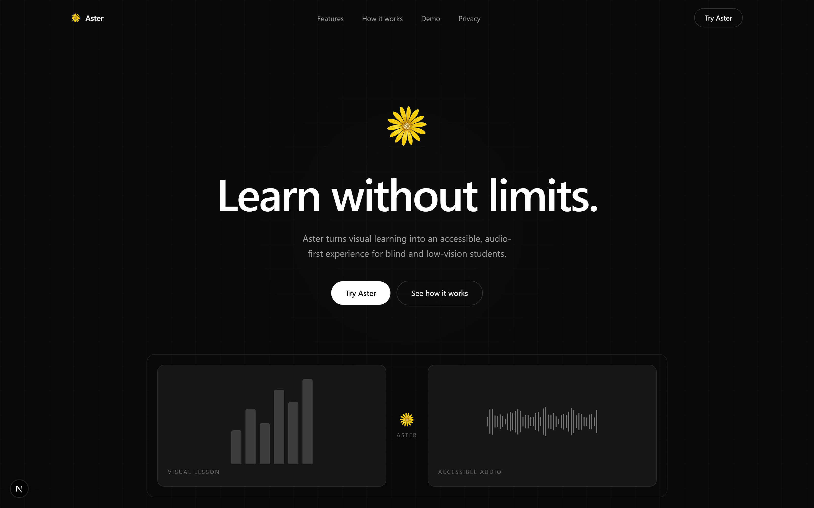
  <br />
  <sub><em>A visual lesson on one side, the same lesson as audio on the other.</em></sub>
</p>

<br />

---

## Meera has the same right to this lecture

Picture a fifteen-year-old in a lower-middle-class home in India. Call her Meera. Her
father drives an auto-rickshaw. There is one phone in the house, and a data pack that has
to last the month.

Meera is blind.

Her physics teacher moves fast, so like millions of students in India she does what
everyone else does — she goes to YouTube, where the entire syllabus is taught for free by
people who explain it better. This is the great equaliser of her generation. A student in
a village can watch the same lecture as a student in Delhi, and it costs neither of them
anything.

Except it does cost Meera something. Fourteen minutes into the lesson, the teacher stops
talking, draws a parabola on the board, and says:

> **"As you can see here…"**

And the lesson ends, for her, right there. Not because the physics is beyond her — because
nobody said out loud what was on the screen. Her sighted classmate takes in the curve in
half a second and moves on. Meera hears silence, then a sentence that assumes she saw it.

**The video is free. The lesson is not.** That gap is not about ability or intelligence. It
is entirely about whether anyone bothered to describe the picture — and it repeats every few
minutes, in every subject, for her entire education.

Aster exists because Meera has exactly the same right to that YouTube lecture as the rest of
us, and she should not have to ask anyone's permission — or wait for the creator to add
descriptions that will never come — to claim it.

<p align="center">
  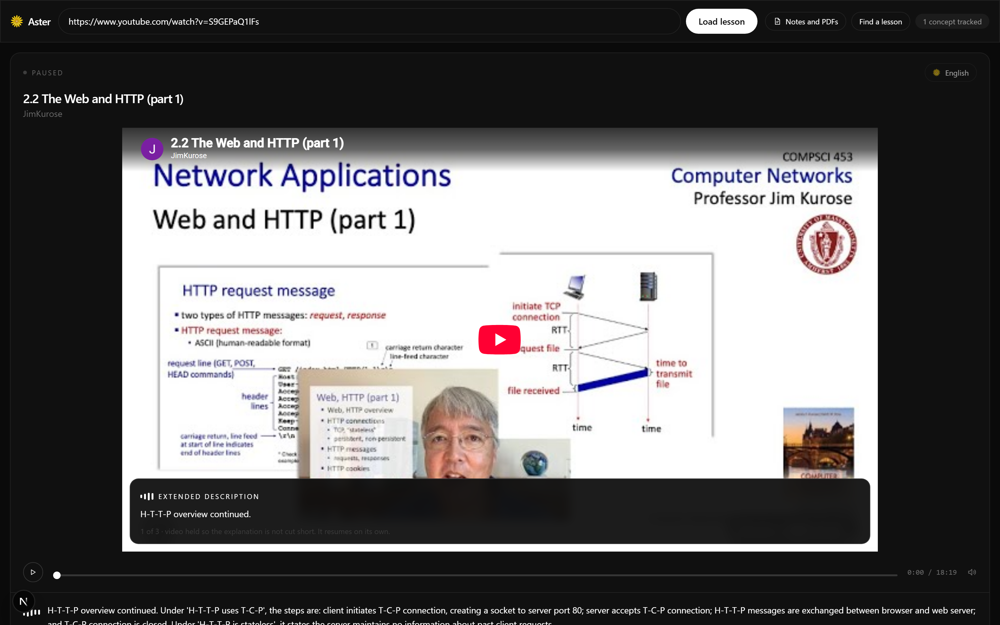
  <br />
  <sub><em>The parabola, described — spoken into the pause, never over the teacher.</em></sub>
</p>

<br />

And Meera is not an edge case. She is one of tens of millions, concentrated in exactly the places
where free video is the only affordable teacher there is.

<p align="center">
  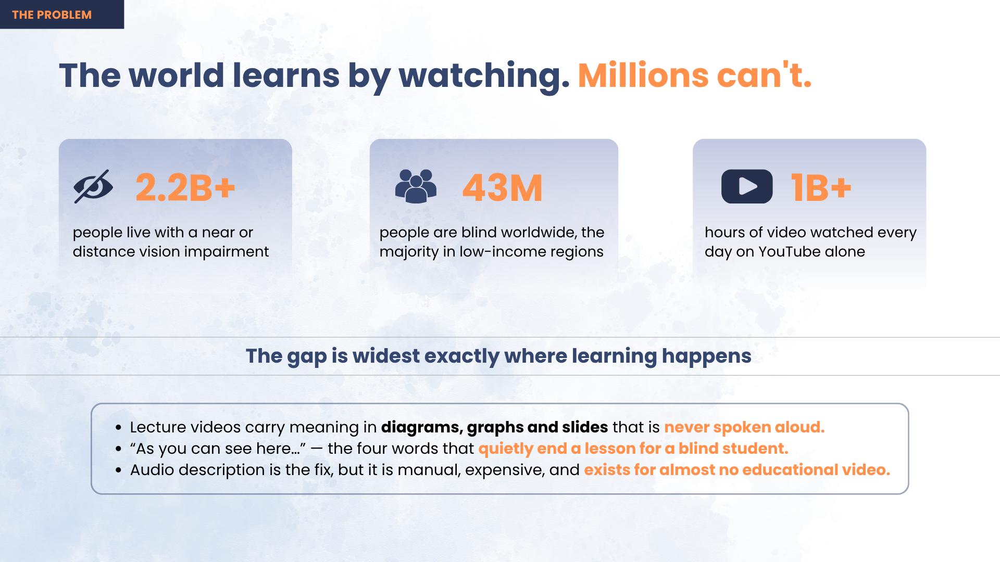
  <br />
  <sub><em>The gap is widest exactly where learning happens.</em></sub>
</p>

---

## Why the things that already exist don't solve it

| What she has today | Why it fails |
|---|---|
| **Screen readers** | They read the *interface*, not the lesson. The play button is announced; the diagram is not. |
| **Captions & transcripts** | They carry the words the teacher said — and the whole problem is what the teacher *didn't* say. "As you can see here" is captioned perfectly and means nothing. |
| **Describe-everything AI** | It narrates every frame and talks straight over the instructor. Two voices at once is not a lesson; it is noise, and it is unusable. |
| **Waiting for accessible content** | Audio description is the real fix, but it is manual and expensive — so it exists for almost no educational video, and never for the lecture she needs tonight. |

Laid out side by side, the pattern is that each tool solves a different problem well and none of
them solves *hers*. A screen reader is built for an interface, a transcript for speech, a chatbot
for questions asked in the abstract. None was built for someone sitting through a lesson that
keeps pointing at things.

<p align="center">
  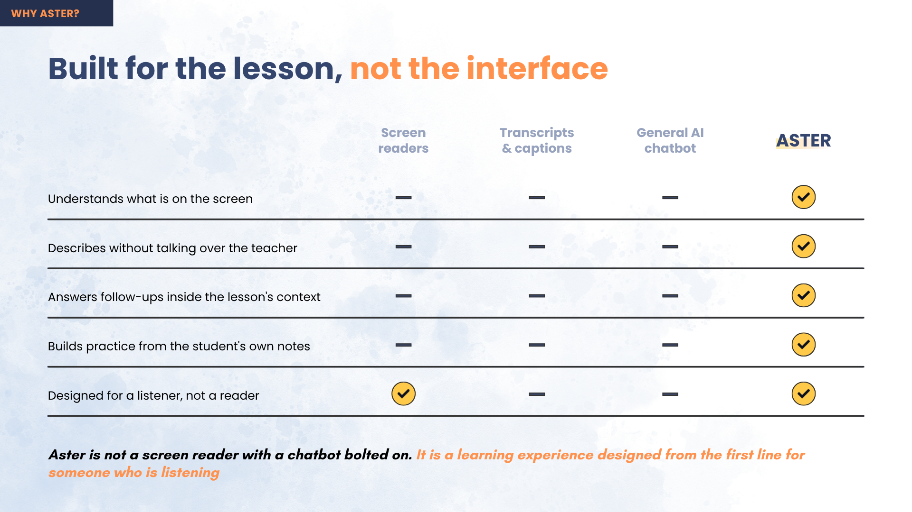
  <br />
  <sub><em>Aster is not a screen reader with a chatbot bolted on.</em></sub>
</p>

<br />

---

## What Aster does differently

**It decides before it describes.** For every candidate moment the question is not *"what is
on screen?"* but:

> ### *"Can the learner follow this without seeing it?"*

Only when the answer is **no** does Aster speak — and it speaks into a natural pause in the
narration, so it never overlaps the instructor. Most of the time it says nothing at all.

> **The rule behind everything: silence is better than a wrong description.**

The whole pipeline is a *narrowing*. Every candidate moment enters, and most of them leave again —
filtered out because the narration already covered it, or because the model was not confident
enough to be worth trusting. What comes out the other end is the small set of moments where the
screen genuinely carries something the words did not.

That judgement is visible as a number in the product. On a real lesson:

<p align="center">
  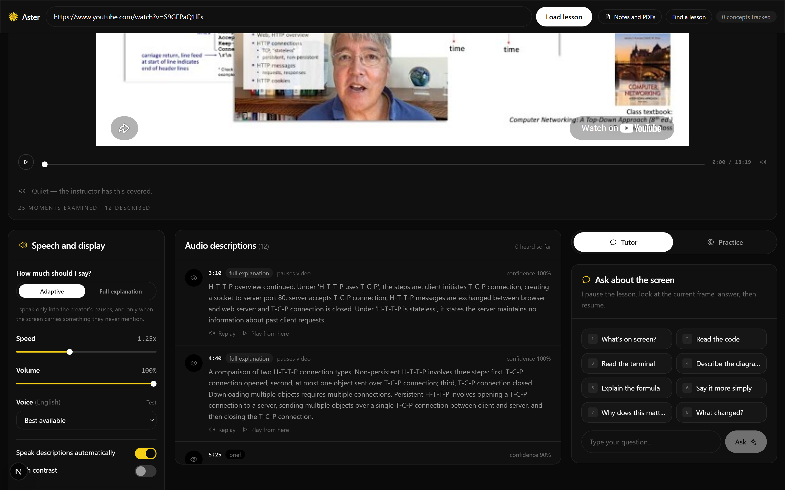
  <br />
  <sub><em><strong>25 moments examined · 12 described.</strong> Aster chose to stay quiet at the other 13.</em></sub>
</p>

### One minute of a physics lecture

The rule is easier to believe as a minute of real time than as a principle. Here is what Aster
does across sixty seconds of a lecture — including the two stretches where the right behaviour is
to do nothing at all, because the teacher is already explaining it perfectly well.

<p align="center">
  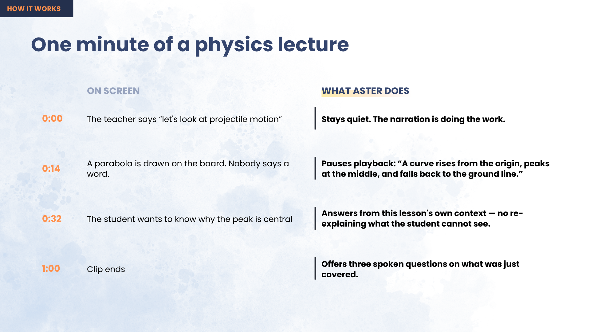
  <br />
  <sub><em>Sixty seconds of a lecture, and what Aster does at each moment of it.</em></sub>
</p>

<br />

Note what happens at 0:14. The parabola appears and nobody says a word, so Aster stops the video
rather than rushing a description into a gap too short to hold it. The lesson waits for her; she
never has to keep up with it.

---

## Watch → Understand → Ask → Practice

Describing the screen gets Meera back to where her classmate started. The rest of the loop is
what gets her to the exam.

She brings a link and her own notes; she leaves with a lesson she can actually sit an exam on.
The four stages are one continuous session, not four features — what gets described is what she
can ask about, and what she asks about is what she gets tested on.

### The lesson surface

Everything is driven from Aster's own controls, never the YouTube player: transport, speech
settings, and the running list of what has been described so far. The video iframe is deliberately
inert — hidden from screen readers and unable to take focus — so she can never land inside a
player she has no way to operate.

<p align="center">
  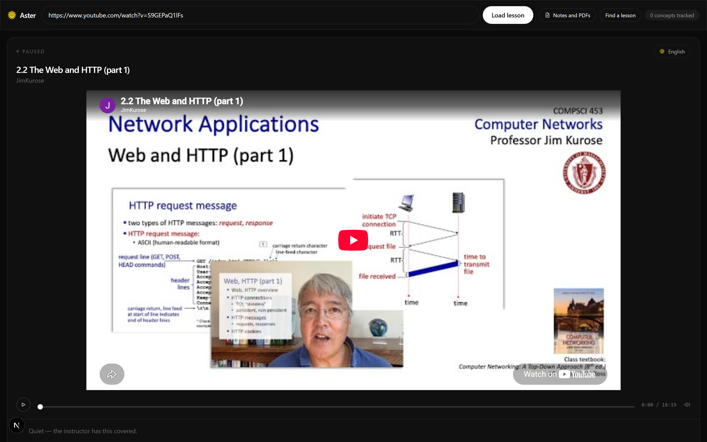
  <br />
  <sub><em>Player, transport, speech settings, and the running list of what has been described.</em></sub>
</p>

<br />

### Ask about the exact thing on screen

Pause anywhere and ask — by keyboard, by one of eight preset keys, or out loud. The answer is
grounded in *this* frame and *this* lesson, not in the model's general knowledge, so "read the
code" returns the code actually on screen rather than a plausible-looking invention. Pressing any
of those keys stops the lesson first: she cannot glance back at what played underneath while she
was busy asking.

### Practice the gap, not the lesson

This is the teaching method, and it is what separates Aster from a quiz generator. Two signals
drive every practice question:

| Signal | Why it matters |
|---|---|
| **A visual Aster had to describe** | The concept reached the learner through the ear rather than the eye — second-hand, single pass, nothing to glance back at |
| **A question the learner asked** | An explicit, timestamped admission of uncertainty |

A concept carrying both is the highest priority in the set. **A concept the instructor narrated
fully is never tested** — Meera received it on equal terms with a sighted student, so there is no
gap to close. Miss a question and the concept is re-explained from a different angle — never the
same words again — then asked later. The logic lives in [`src/lib/practice.ts`](src/lib/practice.ts).

### Find a lesson without seeing the screen

Hold <kbd>W</kbd>, say what you want to learn, and the results are read back. <kbd>Enter</kbd>
loads the one being announced — a lesson found with two keys and no sight.

<p align="center">
  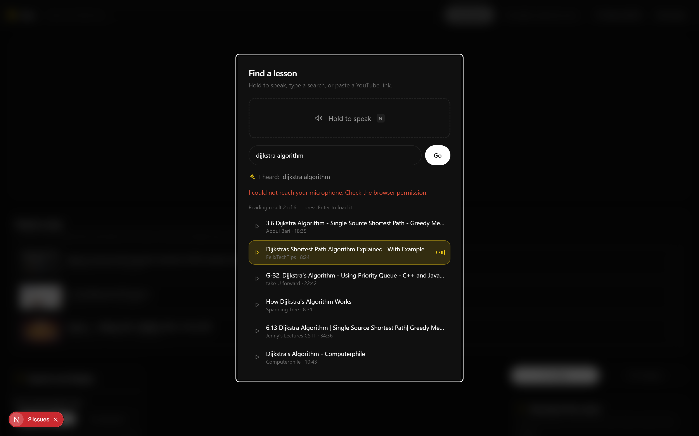
  <br />
  <sub><em>A lesson found with two keys and no sight.</em></sub>
</p>

<br />

### Beyond video: her notes and textbooks too

Lectures are only half of how anyone studies. The same treatment applies to the PDFs a student is
actually examined on — her textbook chapter, a scanned handout, the slide deck the teacher shared.
Figures, tables and diagrams inside the file are described rather than skipped, which is precisely
the content a plain text extraction throws away, and the quiz is drawn from her own syllabus
instead of a generic question bank.

<p align="center">
  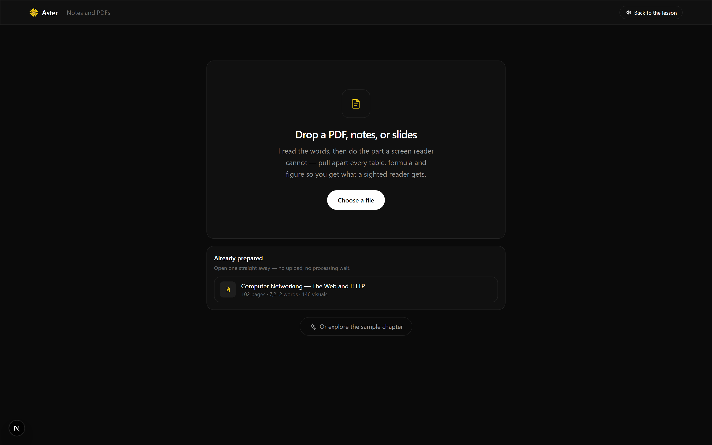
  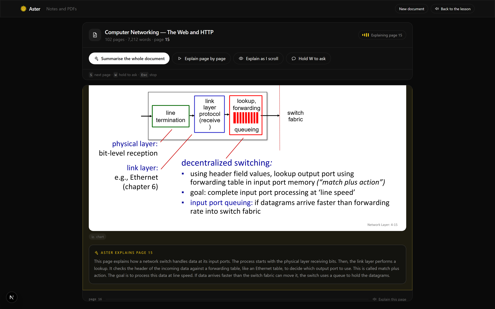
  <br />
  <sub><em>Left: a 102-page networking chapter, already prepared. Right: one of its diagram-heavy
  pages, with Aster's spoken explanation of the figure underneath it.</em></sub>
</p>

---

## Try it without a key

Describing a fresh video takes a few minutes, which is a poor first impression and a worse demo.
So a set of finished lessons ships inside the deployed image and is copied into the cache on first
boot — English, and a Bengali physics lesson described in Bengali. They play instantly: no key, no
upload, no waiting.

---

## How it is built

A Next.js front end talking to an Express API that owns the whole pipeline. The two pieces worth
noticing in the diagram are the **cache**, which is why a second viewing costs nothing and why the
deployed app has lessons ready before anyone visits, and the **fallback ladder** on the model
keys — a free-tier quota running out partway through a long video is the failure that actually
happens, so there is a second key and a second host behind it.

<p align="center">
  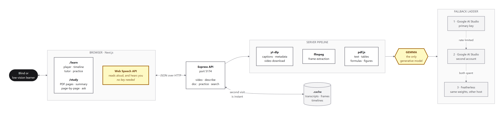
  <br />
  <sub><em>How a request travels: browser → API → pipeline → Gemma, with the cache beside it.</em></sub>
</p>

<br />

**Gemma generates everything.** Every description, answer, practice question and explanation
comes from Gemma 4. yt-dlp (download and search), ffmpeg (frames) and the browser's own speech
engines are supporting tools around it — none of them generates content.

| Surface | Route | What it is |
|---|---|---|
| Landing | `/` | The problem, the loop, the teaching method |
| Lesson | `/learn` | Player, description timeline, tutor, practice |
| Study | `/study` | Notes and PDFs: upload, described figures, document Q&A, quizzes |

### Live deployment

| Half | Host | Why there |
|---|---|---|
| Next.js app | **Vercel** — [aster-coral.vercel.app](https://aster-coral.vercel.app) | Static/SSR, no binaries, no long jobs |
| Express API | **Azure App Service** (Linux container) | Needs yt-dlp, ffmpeg, a writable cache, and runs that take minutes |

YouTube refuses anonymous downloads from datacenter IPs, so the deployed API sends every yt-dlp
request out through a residential proxy — the bot-check keys on the *IP*, not the session, which
is why cookies rot within days on a server and a proxy fixes it outright. Full write-up in
[`docs/deploy.md`](docs/deploy.md).

## Accessibility

Accessibility is the product, not a later pass.

- Every action has a single-key shortcut; press <kbd>?</kbd> for the full list.
- **Skip** and **Replay** sit under the video as labelled buttons *and* on <kbd>S</kbd> / <kbd>R</kbd>.
- Asking a question (<kbd>1</kbd>–<kbd>8</kbd>, <kbd>A</kbd>) or searching (<kbd>W</kbd>) pauses the
  lesson first — a blind learner cannot glance back at what ran past underneath.
- The YouTube iframe is `aria-hidden` and cannot take focus: nobody lands inside a player they
  cannot drive.
- ARIA live regions announce state changes; every control is a native element.
- Visible 3px focus rings, WCAG-AA contrast, a high-contrast mode, adjustable speech rate.
- **`prefers-reduced-motion` is honoured throughout** — motion here is decoration, never information.

## Running it

### 1. Prerequisites

| Requirement | Check | Install |
|---|---|---|
| Node.js 20+ | `node --version` | <https://nodejs.org> |
| yt-dlp | `yt-dlp --version` | `pip install yt-dlp` |
| ffmpeg + ffprobe | `ffmpeg -version` | `winget install Gyan.FFmpeg` · `brew install ffmpeg` |
| Gemma API key | — | <https://aistudio.google.com/apikey> (free) |

### 2. Configure

```bash
cp .env.example .env                 # add GEMMA_API_KEY
cp .env.local.example .env.local     # points the web app at the API
```

### 3. Verify, then run

```bash
npm install
npm run doctor      # checks binaries, key, a real Gemma vision call, YouTube access
npm run dev         # API on :5174, web app on :3000
```

**Do not skip the doctor.** It checks every assumption the pipeline rests on and tells you
exactly which one is missing.

## Layout

```
server/                 Express API — the whole model pipeline
  src/services/
    gemma.js            the only model client
    youtube.js          id parsing, metadata, download, subtitles
    transcript.js       caption parsing, language, context windows
    gaps.js             speech intervals, natural pauses, candidate moments
    frames.js           ffmpeg frame extraction
    comprehension.js    understand-the-whole-video pass
    timeline.js         decide-then-describe orchestration + confidence rules
    pdf.js              PDF text, table, formula and figure extraction
  src/routes/           meta, video, describe, search, doc, practice
src/                    Next.js app
  lib/practice.ts       the gap-driven teaching method
  components/learn/     player, speech, scheduler, tutor, practice, search
  components/study/     upload, reader, document Q&A, quiz
  components/motion/    parallax, reveal, blur-in text, tilt, magnetic
docs/
  diagrams/             architecture, pipeline and solution diagrams (light + dark)
  screenshots/          ten captures of the running app
  deploy.md             how Azure and Vercel are wired
```

## Stack

Next.js (App Router) · TypeScript · Tailwind v4 · Motion · Express · Gemma 4 · yt-dlp · ffmpeg.
No AI SDKs — Gemma is called over plain HTTPS. Speech recognition and synthesis both run in the
browser, so spoken search and spoken answers need no key and no server round trip.

## Status

| Area | State |
|---|---|
| Speech synthesis, voice selection, rate/volume | Real |
| YouTube player, transport, scheduling | Real |
| Description pipeline, frame Q&A, video search | Real — needs `GEMMA_API_KEY` |
| PDF text, table, formula, figure extraction | Real |
| Figure *description* and document quizzes | Needs the key |
| Gap-driven practice logic | Real, runs on whatever data it is given |
| Deployed API + web app | Live on Azure and Vercel |

Both surfaces fall back to a sample lesson and sample chapter when no server is reachable, so
the interface is explorable without a key.

---

<p align="center">
  <strong>The goal:</strong> any lecture video on the internet becomes usable by a blind student,
  <br />without asking the creator to do anything.
</p>

<br />

<p align="center">
  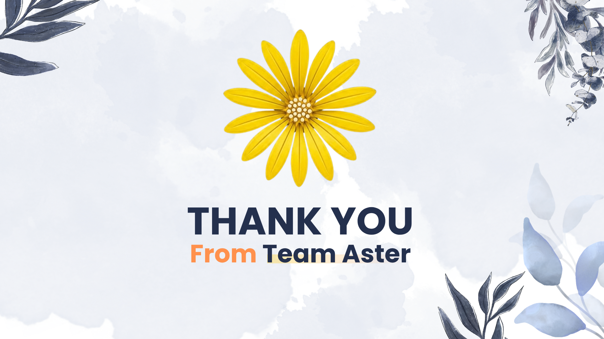
</p>

<p align="center">
  <sub>The full deck lives in <a href="docs/Aster-Pitch-Deck">docs/Aster-Pitch-Deck</a>.</sub>
</p>
